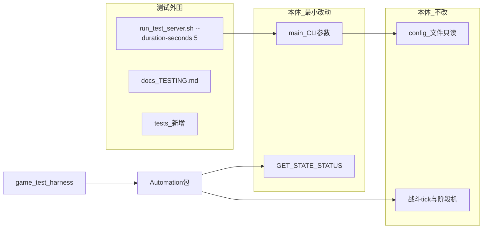
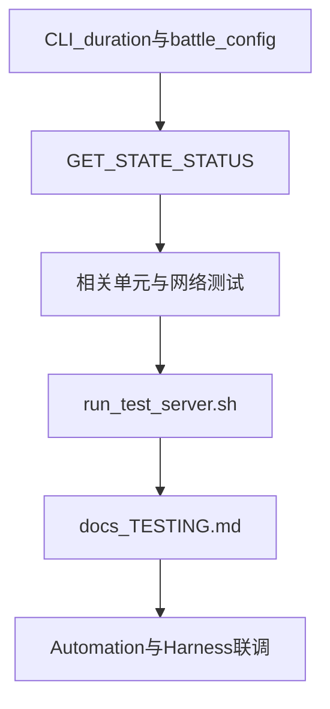

# 服务端测试仓库支撑计划

> **客户端 Automation 方案**：`Software_client/.cursor/plans/客户端Automation方案.plan.md`  
> **测试仓库方案**：`Software_client/.cursor/plans/测试仓库方案.plan.md`  
> **客户端仓库**：`Software_client`（Unity C#，游戏本体**不改动**，仅新增 Automation UPM 包）

## 1. 目标与边界

测试仓库（独立 Unity 工程 `game-test-harness`）负责：多开客户端实例、CLI/GUI 编排、调用 **`GameClientSession`（Automation 包）** → `NetworkManager` → 本服务端。

本 server 仓库负责：可稳定连接的五域服务、可预测阶段推进、**CLI 可调战斗参数**、**最小本体改动**接入 `GET_STATE_STATUS`；**不**新增/修改 `config/**` 内任何文件。

### 1.1 解耦原则

| 层级 | 路径范围 | 本次策略 |
|------|---------|---------|
| **游戏本体（最小改动）** | `main.cpp`、`server.h`、`server.cpp` + GET_STATE_STATUS 相关 `protocol.h`/`room.*` | CLI 启动参数 + type=9 接入；不改阶段机/战斗/商店核心逻辑 |
| **测试外围** | `scripts/`、`tests/`（新增）、`docs/TESTING.md` | 启动脚本转发参数、验收测试、联调文档 |
| **配置** | `config/**` | **零修改、零新增**；默认值仍来自现有 JSON，运行时由 **CLI 覆盖** |
| **文档** | `README.md`、`docs/ARCHITECTURE.md` | 轻量增补 + 链到 `docs/TESTING.md` |



**关键约束（不变）：**
- 五端口同进程、共享 [`ServerState`](include/server.h)
- 传输：TCP 一行 JSON + `\n`
- 测试仓库**不**绕过客户端直打 TCP

---

## 2. 需求 ↔ 服务端能力映射

| 测试需求 | 服务端现状 | 关键入口 |
|---------|-----------|---------|
| 新建账户 | ✅ REGISTER 自增 uid | `register_user` |
| 登录/退出 | ✅ | `login_user` / `logout_user` |
| 创建/加入/退出大厅 | ✅ | `create_room` / `join_room` / `leave_room` |
| 简化商店/选路/战斗 | ✅ | `Room::Phase` |
| 联调时缩短战斗 | ⚠️ 仅读 `battle_config.json` 默认 180s | **本期** CLI `--duration-seconds` |
| GUI 轮询房间阶段 | ⚠️ 枚举已预留 | **本期** `GET_STATE_STATUS(9)` |

### 2.1 端到端阶段契约

与 [`tests/network_tests/integration_helpers.h`](tests/network_tests/integration_helpers.h) 一致；`GET_STATE_STATUS` 为可选观测接口。

### 2.2 多开注意事项

- 每实例独立 uid；同步点：`SET_READY`、`MAP_MOVE`（同 selectId）、`PLAYER_READY`
- **先 `LEAVE_ROOM` 再 `LOGOUT`**
- END 阶段无重开；新局需新建 room

---

## 3. 客户端实现对齐要点

- Automation 自行持有 **8769**（battlePort）
- `GET_STATE_STATUS` DTO 在 Automation 包新增，**不改**游戏本体
- 胜利条件：**定时** `durationSeconds`；联调时由 **server 启动参数** 决定，非客户端侧配置

---

## 4. 服务端改动

### 4.0 目录结构（本计划涉及文件）

```
server/
├── include/
│   ├── protocol.h                                [MOD]  GetStateStatusReq / GetStateStatusRsp
│   ├── room.h                                    [MOD]  build_state_status_snapshot()
│   └── server.h                                  [MOD]  ServerState 启动选项；get_state_status()；COMMAND_TABLE 7 项
├── src/
│   ├── main.cpp                                  [MOD]  解析 --duration-seconds / --battle-config
│   ├── room.cpp                                  [MOD]  状态快照
│   └── server.cpp                                [MOD]  get_state_status()；按 ServerState 选项加载/覆盖 battle 配置
├── scripts/
│   └── run_test_server.sh                        [NEW]  转发 CLI（见 4.2）
├── docs/
│   └── TESTING.md                                [NEW]
├── tests/
│   ├── network_tests/
│   │   ├── get_state_status_network_tests.cpp    [NEW]
│   │   ├── server_cli_battle_network_tests.cpp   [NEW]  验证 --duration-seconds 生效（可选 subprocess）
│   │   └── test_server_profile_network_tests.cpp [NEW]  Harness 注入（CI 不启子进程）
│   └── unit_tests/
│       ├── server_config_cli_tests.cpp           [NEW]  main 参数解析 / ServerState 覆盖逻辑
│       └── server_dispatch_tests.cpp             [MOD]  路由含 type=9
├── README.md                                     [MOD]
└── docs/ARCHITECTURE.md                          [MOD]
```

**不在本次修改范围：**

```
config/**  （文件内容不动；运行时通过 CLI 选路径或覆盖 duration）
src/battle_*.cpp, src/channel.cpp, src/map.cpp
include/types.h（枚举已存在）, include/battle.h, …
```

### 4.1 CLI 战斗参数（替代 test config / 脚本覆盖文件）

在 [`src/main.cpp`](src/main.cpp) 扩展启动参数（与现有 `--config` 风格一致）：

| 参数 | 说明 | 默认 |
|------|------|------|
| `--config <path>` | 五端口（已有） | `config/server.json` |
| `--battle-config <path>` | 指定 battle JSON **绝对或相对路径** | 现有 `load_battle_config()` 搜索路径 |
| `--duration-seconds <n>` | 加载 battle 配置后**覆盖** `durationSeconds` | 不覆盖（用 JSON 内值，默认 180） |

**加载顺序：**

1. 若指定 `--battle-config`，从该路径加载到 `ServerState::battleConfig`
2. 否则沿用 [`load_battle_config()`](src/server.cpp) 现有相对路径逻辑（依赖 CWD）
3. 若指定 `--duration-seconds`，覆盖 `battleConfig.durationSeconds`（须 `n > 0`）
4. 启动日志打印：`Battle config: durationSeconds={}`（便于 WSL / Harness 确认）

**WSL 手动示例：**

```bash
cd /path/to/server
./build/server --config config/server.json --duration-seconds 5
# 或指定任意路径的 battle JSON（不改 repo 内 config 文件）：
./build/server --battle-config /tmp/my_battle.json --duration-seconds 10
```

**实现要点：**

- [`ServerState`](include/server.h) 增加 `std::optional<std::string> battleConfigPath`、`std::optional<int> durationSecondsOverride`（或等价 StartupOptions），在创建五个 `Server` **之前**由 `main` 写入
- [`Server`](src/server.cpp) 构造函数：若 `battleConfig` 尚未 complete，按 `battleConfigPath` 或默认路径加载；最后应用 `durationSecondsOverride`
- **不**新增 `config/*.test.json`；联调短战斗完全靠 CLI

### 4.2 启动脚本

[`scripts/run_test_server.sh`](scripts/run_test_server.sh)：

1. `cd` 到 repo 根
2. **透传**所有参数给 `./build/server`；若无显式 `--duration-seconds`，脚本默认追加 **`--duration-seconds 5`**（便于联调；生产式长跑可 `./scripts/run_test_server.sh --duration-seconds 180` 或省略并依赖 JSON 默认）
3. 固定携带：`--config config/server.json`（除非调用方已在 `"$@"` 中覆盖）
4. 可选：五端口 TCP 探测

```bash
# 联调默认（约 5s 战斗）
./scripts/run_test_server.sh

# 手动指定
./scripts/run_test_server.sh --duration-seconds 15

# 等价 WSL 直跑
./build/server --config config/server.json --duration-seconds 5
```

**Harness / 测试程序脚本**：启动 server 子进程时传入相同参数即可，无需改 `config/battle_config.json`。

### 4.3 接入 GET_STATE_STATUS（type=9）

（内容同前版：Req/Rsp、`build_state_status_snapshot()`、COMMAND_TABLE 第 7 项、响应字段表。）

**Automation / Harness：** 可选 `GetStateStatusAsync()`；CLI 场景仍可用 pushMessages。

### 4.4 文档

[`docs/TESTING.md`](docs/TESTING.md) 须包含：

- CLI 参数表与 WSL / `run_test_server.sh` 示例
- Harness 启动 server 时推荐 `--duration-seconds 5`（与 Automation 战斗等待超时对齐）
- `GET_STATE_STATUS` 契约、五端口、pushMessages

### 4.5 验收测试

| 测试 | 说明 |
|------|------|
| `server_config_cli_tests.cpp` | `--duration-seconds` 覆盖、`--battle-config` 绝对路径 |
| `get_state_status_network_tests.cpp` | ready 后 `roomPhase` 0→1 |
| `server_dispatch_tests.cpp` | type=9 路由 |
| `test_server_profile_network_tests.cpp` | Harness 内存注入（CI 快速路径，不依赖子进程） |

---

## 5. 测试仓库连接契约

**Server 进程（Harness 负责拉起时）：**

```bash
./build/server --config config/server.json --duration-seconds 5
```

**Automation 客户端端点：**

```json
{
  "host": "127.0.0.1",
  "loginPort": 8765,
  "homePort": 8766,
  "shopPort": 8767,
  "mapPort": 8768,
  "battlePort": 8769
}
```

**测试仓库 plan 需同步：** Harness 启动 server 子进程时传 `--duration-seconds`（建议默认 5）；Automation 战斗 `IdleUntilEnd` 超时设为 `durationSeconds + 缓冲`（如 15s），**无需**再假设固定 180s。

---

## 6. 已知缺口与测试策略

| 缺口 | 测试侧应对 | 本期 server |
|-----|-----------|------------|
| 默认 180s 战斗过长 | **`--duration-seconds` CLI** + 脚本默认 5 | **是** |
| GET_STATE_STATUS 未接入 | 本期接入 | **是** |
| 无持久化 / END 无重开 | Harness 拆 session | 否 |

---

## 7. 验收标准

### 7.1 服务端仓库内

```bash
cmake --preset release && cmake --build --preset release --target unit_tests
ctest --test-dir build -R "network_tests::" --output-on-failure
ctest --test-dir build -R "^get_state_status_network_tests::" --output-on-failure
ctest --test-dir build -R "^server_config_cli_tests::" --output-on-failure
```

1. 现有网络测试全绿
2. `--duration-seconds 5` 启动时，日志与战斗行为反映 5s（非 180s）
3. `GET_STATE_STATUS`：ready 后 `roomPhase` LOBBY→SHOP
4. `run_test_server.sh` 默认短战斗并成功监听五端口

### 7.2 跨仓库联调

- Harness 传 `--duration-seconds 5` 启动 server，完整战斗 E2E **≤15s** 可结束
- GUI 可轮询 `GET_STATE_STATUS`

---

## 8. 实施顺序



优先 **CLI 战斗参数**（阻塞联调闭环），其次 GET_STATE_STATUS。

---

## 9. 不在本期范围

- 不新增/修改 `config/**` 文件内容
- 不实现 `SEND_MESSAGE` / `HEARTBEAT`
- 不改五端口合并、不引入 DB
- 不在 server 仓库实现 C#/Unity
