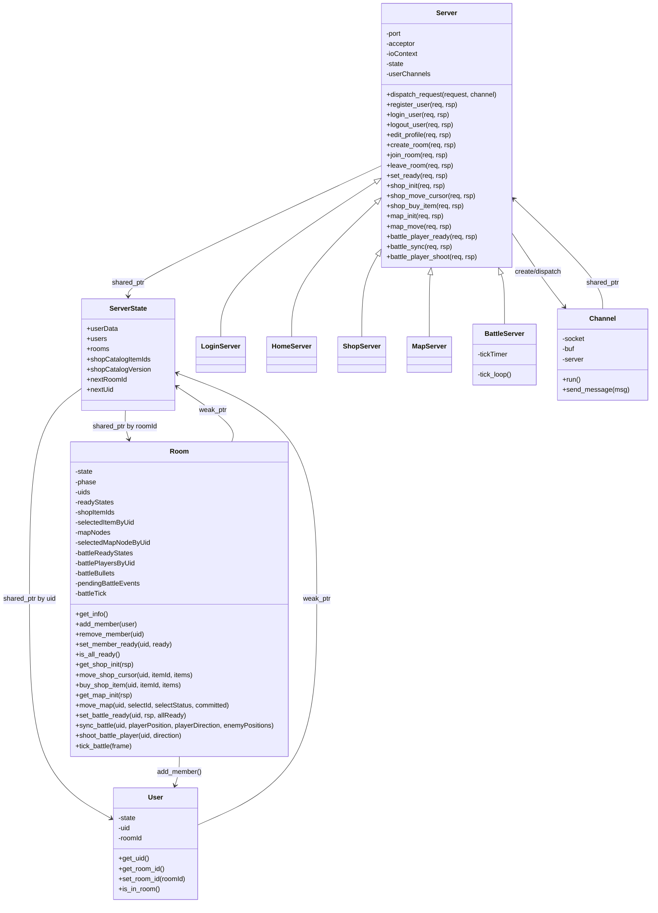

# 项目结构与接口设计

本文档描述当前代码实现的真实架构、运行时关系与协议约束。

## 1. 总体架构

服务端是单进程、事件驱动模型：

- 单个 `asio::io_context` 驱动所有网络 I/O 和定时任务
- 五个服务实例共享同一份 `ServerState`
- `Channel` 负责连接读写与消息分帧
- `Room` 是房间维度的聚合根，内部承载商店、地图、战斗状态和阶段状态机
- `BattleServer` 通过固定 tick 循环驱动战斗帧广播

启动路径：

1. `main.cpp` 解析 `--config`，读取 `config/server.json`
2. 创建共享 `ServerState`
3. 启动五个服务实例：
   - `LoginServer(authPort)`
   - `HomeServer(lobbyPort)`
   - `ShopServer(shopPort)`
   - `MapServer(mapPort)`
   - `BattleServer(battlePort)`
4. `main.cpp` 显式调用各个服务的 `start()`
5. `Server::start()` 启动接受连接流程（内部保证只启动一次）
6. 新连接会创建一个 `Channel`
7. `Channel::run()` 按行读取 JSON，调用 `server->dispatch_request()`

## 2. 类图



## 3. 模块职责

### 3.1 Protocol 层

协议定义拆成三层：

- `include/types.h`
  - 基础枚举与共享类型
  - `LoginRequestType`、`HomeRequestType`、`ShopRequestType`
  - `ShopResponseType`、`MapRequestType`、`MapResponseType`
  - `Protocol::Code`
  - `PlayerBasicInfo`、`PlayerData`、`RoomInfo`、`MapNode`
- `include/protocol.h`
  - `ShortEnvelope`、`LongEnvelope`
  - 登录/大厅/商店/地图请求响应结构
- `include/battle.h`
  - 战斗实体模型
  - 战斗请求响应结构
  - 战斗事件 DTO

当前关键约束：

- `type` 一律是数值枚举，不能改成字符串
- `HomeRequestType::HEARTBEAT = 5` 是保留值，不能复用
- `HomeRequestType::BROADCAST = 8` 仅用于大厅内服务端广播
- `ShopRequestType::SHOP_BUY = 2` 是当前购买命令值
- `ShopResponseType::SHOP_SYNC = 0` 是当前商店广播类型
- `BattlePushMessageType::BATTLE_START = 0` 用于战斗启动首帧
- `BattlePushMessageType::BATTLE_END = 1` 用于战斗结束帧

### 3.2 Server 层

`Server` 是所有服务的共同基类，负责：

- 监听端口并接受连接
- 通过模板桥接统一命令分发
- 原子地执行业务状态迁移
- 维护当前服务实例上的 `uid -> channel` 弱引用映射
- 向房间成员广播 `LongEnvelope`

分发模型：

- `DispatchFn = json (*)(Server&, const json&)`
- `dispatch_entry_short<Req, Rsp, Method>`：生成 `ShortEnvelope`
- `dispatch_entry_long<Req, Rsp, Method>`：生成 `LongEnvelope` 或无直返包

五个子类分别只保留“命令表 + 领域入口”：

- `LoginServer`：认证命令
- `HomeServer`：大厅与房间命令
- `ShopServer`：商店阶段命令
- `MapServer`：地图阶段命令
- `BattleServer`：战斗命令与帧广播

### 3.3 Channel 层

`Channel` 负责连接级别工作：

- `run()` 读循环
- 以 `\n` 作为消息边界
- 处理空帧、超长帧和 JSON 解析失败
- 将请求转交给当前连接绑定的 `Server`
- 将 `dispatch_request()` 返回的 envelope 发送回客户端

### 3.4 Room 层

`Room` 不是简单 DTO，而是房间生命周期的聚合根。当前它内部同时维护：

- 显式阶段：`LOBBY`、`SHOP`、`MAP`、`BATTLE`、`END`
- 房间成员列表与 ready 状态
- 商店物品目录、选择状态和已购买道具
- 地图节点与每个玩家的选择同步状态
- 战斗 ready 状态、玩家实体、子弹实体、事件队列和 tick 计数器

这意味着阶段切换不是跨对象协作，而是 `Room` 内部状态机的演进。

## 4. 运行时行为

### 4.0 房间阶段状态机

`Room` 用内部 `Phase` 约束业务入口，避免跨阶段请求绕过流程。

阶段推进：

1. `LOBBY`
   - 初始阶段
   - 允许 `JOIN_ROOM`、`LEAVE_ROOM`、`SET_READY`
   - 全员 `SET_READY=true` 后进入 `SHOP`
2. `SHOP`
   - 允许 `SHOP_INIT`、`SHOP_MOVE_CURSOR`、`SHOP_BUY`
   - 临时测试旁路允许直接 `PLAYER_READY` 跳过商店和地图
   - 首次合法 `MAP_INIT` 会生成/返回地图，并推进到 `MAP`
3. `MAP`
   - 允许 `MAP_INIT`、`MAP_MOVE`
   - 全员提交同一个合法地图节点后，才允许 `PLAYER_READY`
   - 全员 battle ready 后进入 `BATTLE`
4. `BATTLE`
   - 允许 `BATTLE_SYNC`、`PLAYER_SHOOT`、`tick_battle()`
   - 非战斗入口返回 `ROOM_STATE_ERROR`
   - 胜利且当前地图节点仍有后继时回到 `MAP`
   - 失败或最后节点胜利时进入 `END`
5. `END`
   - 本轮流程结束

成员离房/登出属于清理动作，不受阶段限制；新成员加入只允许在 `LOBBY`。

### 4.1 大厅与房间生命周期

- `CREATE_ROOM` 创建 `Room` 并把创建者放入成员列表
- `JOIN_ROOM` 只能在 `LOBBY` 阶段成功；`LEAVE_ROOM` 用于任意阶段的成员清理
- `SET_READY` 只能在 `LOBBY` 阶段成功，并更新 `readyStates`
- 当房间内所有成员 ready 时，服务端广播：
  - `type = HomeRequestType::BROADCAST`
  - `pushMessages = [0]`
  - `data` 中携带最新 `roomInfo`
- 全员 ready 后，`Room` 进入 `SHOP`

这里的 `pushMessages[0]` 不是一个新的 `HomeRequestType`，而是给客户端的附加语义位，用于表达“当前房间已全员准备”。

### 4.2 商店阶段

- 商店目录启动时从 `config/shop_catalog.json` 读入 `ServerState`
- `Room` 在构造时快照该目录版本和完整物品列表，并随机打乱一次顺序
- 房间当前可见物品数量等于 `min(当前人数, 目录物品数)`
- 商店接口只在 `SHOP` 阶段成功
- `SHOP_INIT` 走 direct long response，返回 `{items, playerInfos}`
- `SHOP_MOVE_CURSOR` 成功后不发送 direct response，而是广播 `SHOP_SYNC`
- `SHOP_MOVE_CURSOR` 的 `itemId` 不存在时，当前实现按“取消当前选择”处理，不返回错误
- `SHOP_BUY` 成功后广播 `SHOP_SYNC`
- `SHOP_BUY` 会校验 item 是否在当前可见前缀内，且不能重复购买

### 4.3 地图阶段

- `MAP_INIT` 只在 `SHOP` 或 `MAP` 阶段成功，首次成功调用会把阶段从 `SHOP` 推进到 `MAP`
- `MAP_INIT` 返回当前房间共享地图
- `MAP_MOVE` 只在 `MAP` 阶段成功，并维护每个玩家的选点状态
- 当所有玩家对同一可提交节点达成一致时，广播 `MapResponseType::MAP_SYNC`

当前地图生成约束：

- 地图第一列和最后一列都是单节点
- 最后一列节点类型固定为 `BOSS`
- 相邻列连接使用单调区间覆盖：无交叉、允许一对多、允许多对一，并覆盖后一列全部节点
- 首次提交必须从根节点开始；后续提交必须是当前已提交节点的合法后继

### 4.4 战斗阶段

战斗由 `BattleServer` 主动驱动，而不是由每个请求直接返回帧：

- `BattleServer` 每 16ms 触发一次 `tick_loop()`
- `tick_loop()` 扫描所有房间，调用 `Room::tick_battle()`
- 若房间战斗已开始，则广播 `BATTLE_FRAME`

`PLAYER_READY` 行为：

- 临时允许在 `SHOP` 阶段直接成功，使用普通敌人池
- 在 `MAP` 阶段仍要求当前地图节点已经提交
- 未全员 ready：广播 `BATTLE_WAIT`
- 全员 ready：
  - `Room::set_battle_ready()` 内部启动战斗状态
  - 服务端立即生成一次首帧
  - 广播 `BATTLE_FRAME`
  - `pushMessages = [BATTLE_START]`

`BATTLE_SYNC` 行为：

- 请求上报客户端实际玩家位置、玩家方向和本地计算出的怪物位置
- 玩家位置以最新合法上报为准
- 怪物位置在 `Room::tick_battle()` 中按实体聚合，各客户端同一 tick 内最新上报取均值
- `BATTLE_FRAME` 不再每帧同步怪物/子弹实体列表；怪物和子弹出生、命中、销毁通过事件广播
- 未知怪物或非有限坐标会被忽略
- 非 `BATTLE` 阶段的 `BATTLE_SYNC` 会失败

`PLAYER_SHOOT` 行为：

- 校验战斗已开始、玩家存在、射击方向有限且非零
- 服务端归一化射击方向，立刻创建玩家子弹实体和 `BULLET_SPAWN` 事件
- 子弹在 tick 中按固定速度推进
- 子弹越过战斗边界时产生 `BULLET_HIT_WALL` 和子弹 `ENTITY_DESTROY`
- 子弹命中敌人时依次产生 `BULLET_HIT_ENEMY`、`ENTITY_DAMAGE` 和子弹 `ENTITY_DESTROY`
- 敌人 HP 归零时追加敌人 `ENTITY_DESTROY`，并从后续帧中移除

战斗结算：

- 当前帧敌人清空表示胜利
- 全部玩家死亡表示失败
- 结束帧会带 `BattlePushMessageType::BATTLE_END`
- 直达战斗胜利时，`Room` 清空战斗临时状态并进入 `END`
- 地图路径胜利且当前地图节点有后继时，`Room` 清空战斗临时状态并回到 `MAP`
- 失败或最后节点胜利时，`Room` 清空战斗临时状态并进入 `END`

## 5. 协议契约

### 5.1 传输层

- TCP 文本帧
- 一条 JSON 一行
- 最大消息长度：`65536`

### 5.2 Envelope 语义

短响应 `ShortEnvelope`：

- 适用于登录、建房、列房间等 request/response 命令
- 结构：`{code, data, message}`

长响应 `LongEnvelope`：

- 适用于阶段同步和服务端推送
- 结构：`{type, data, pushMessages}`
- direct long response 不带 `code/message`
- `NoResponseRsp` 表示命令成功，但 direct response 由连接层直接省略

### 5.3 错误码

`Protocol::Code` 采用位掩码：

- 状态位：`SUCCESS`、`FAIL`、`ERROR`
- 细节位：`BAD_REQUEST`、`NOT_FOUND`、`ROOM_STATE_ERROR` 等

这意味着客户端不能把 `code` 当成单一枚举值比较，而应按位判断。

## 6. 并发模型

- 逻辑上是单进程协程驱动
- 共享状态仍由互斥锁保护：
  - `usersMutex`
  - `roomsMutex`
  - `userDataMutex`
  - `userChannelsMutex`（在各 `Server` 实例内部）
- `Room` 自身还有 `roomMutex` 保护房间内部聚合状态

当前实现仍偏向“串行事件循环 + 保守加锁”，而不是多线程并行模拟。

## 7. 构建与测试

构建系统特征：

- CMake 3.21+
- Ninja presets：`release`、`debug`、`debug-tests`、`release-vcpkg`
- `SERVER_FETCH_DEPS=ON` 时自动拉取缺失依赖
- 默认 `SERVER_BUILD_TESTS=OFF`
- 非 `main.cpp` 业务源码会先编译为 `server_core`，再由 `server` 和测试目标共同链接复用
- `server_core` 使用预编译头缓存 `asio.hpp`、`nlohmann/json.hpp` 与常用 STL 头
- 测试目标复用 `server_core` 的 PCH，降低重复编译成本

测试现状：

- `tests/unit_tests/protocol_tests.cpp` 覆盖协议枚举稳定性与 Envelope JSON 往返
- `tests/unit_tests/room_behavior_tests.cpp` 覆盖房间成员、ready、阶段约束、商店物品数量、战斗推进与结算
- `tests/unit_tests/map_tests.cpp` 覆盖地图连接无交叉、全覆盖与层级一致性
- `tests/unit_tests/server_auth_room_lifecycle_tests.cpp` 覆盖房间/商店主流程
- `tests/unit_tests/server_dispatch_tests.cpp` 与 `server_error_paths_tests.cpp` 覆盖分发与错误路径
- `tests/network_tests/shop_network_tests.cpp`、`map_network_tests.cpp`、`battle_network_tests.cpp` 覆盖跨端口阶段流
- 压测脚本位于 `tests/stress_tests/`

推荐测试命令：

```bash
cmake --preset debug-tests
cmake --build --preset debug-tests
ctest --preset debug-tests
```

## 8. 维护约定

- 任何协议字段、枚举值、push 语义变更，都必须同步更新：
  - `README.md`
  - `docs/ARCHITECTURE.md`
  - `docs/TESTING_CHECKLIST.md`
  - 相关测试
- 任何阶段迁移或入口权限变更，都必须同步更新阶段状态机文档和阶段行为测试
- 任何新增服务实例或启动参数，都必须同步更新 `config/server.json` 与运行说明
- 任何新的 tick 驱动行为，都应优先在 `Room`/`BattleServer` 两侧写单元测试锁定语义
